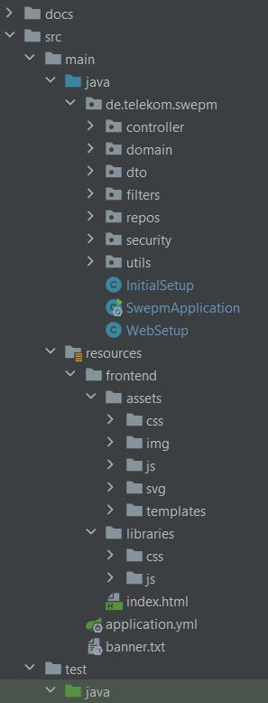
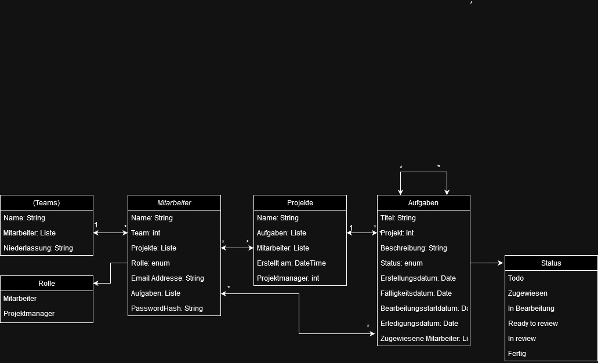

# Agile Software Entwicklung - Projektmanagement Webanwendung: Projio

## Project Information

The application runs on port 8069.

#### Login Credentials (username/password)

    projio/projio

- ~~max.mustermann@mail.de/max~~
- ~~erika.mustermann@mail.de/erika~~
- ~~otto.normalverbraucher@mail.de/OTTOnormalverbraucher123~~

### Useful Links

[Current Sprint Board](https://github.com/users/phillipc0/projects/2/views/1)

[Planning Board](https://github.com/users/phillipc0/projects/2/views/10)

### Sprint overview guidance

- Sprint 1: Inital FE & BE Setup/Structure, first Webpages
- Sprint 2: User Managment & Project overview/selection
- Sprint 3: Task implementation & Task overview/Project Page & Finish User Actions FE/BE
- Sprint 4: Finish Tasks & UI/UX enhancments
- Sprint 5: Excitment features
- Sprint 6: Final bug fixes/enhancments & Documentation

### Members & Roles

- Daniel: Dev & Scrum Master
- Jan: Dev
- Max: Dev
- Phillip: Dev & Product Owner
- Robin: Dev
- Xaver: Dev

## Setup

### Cloning Repo

1. Then go to "Get From VCS" OR "File | New | Project from Version Control" and paste the repository
   URL (https://github.com/phillipc0/SWE-PM) then press clone
    1. If IntelliJ requires you to authenticate, try to use "Log in via Github" it **will likely fail** with the error "
       clone failed, repository not found"
    2. If this does not work then you have to Create **Personal access token** (classic)
       on https://github.com/settings/tokens with the following scopes: **repo, workflow, gist, read:org** and use the "
       Token" method in IntelliJ
2. Wait until a notification appears with the button **"Load Maven Project"** and click on it
3. Set the Java-SDK in File | Project Structure to the **Java 17 Amazon Coretto** Version
4. Sync the maven project and download all dependencies

### Enable IntelliJ formatting settings

1. Go to File | Settings | Editor | Code Style
2. Click on Scheme and select the Project Scheme

### Enable Sonarlint code analysis

1. Go to File | Settings | Plugins
2. Search for SonarLint, click install and ok
3. Once prompted Restart IntelliJ

### Enable Code reformatting

1. Go to File | Settings | Tools | Actions on Save
2. Check Reformat Code and Optimize Imports

## Technical Information

### Project Structure



**Further explanations of backend packages:**

- controller: @Controller classes, which define the api endpoints
- domain: @Entity classes, database Models
- dto: @Data classes, request and response classes of our api
- filters: @OncePerRequestFilter classes, Spring filters
- repos: @Repository classes, api to our database, define database access methods here
- security: Spring security/login related classes
- utils: other utility classes/services

### Database / Class Scheme



### Adding Tooltip to HTML Element

1. Add the custom Tooltip `<span>` around the HTML Element you want to show a tooltip
2. Set the color by changing the `data-bs-custom-class` to **"tooltip-white/gray/yellow/orange/red"**
3. Choose the position by changing the `data-bs-placement` to **"top/bottom/left/right"**
4. Add the Tooltip Text by changing the text in the `title`

```html
<span data-bs-custom-class="tooltip-white/gray/yellow/orange/red" data-bs-placement="top/bottom/left/right"
      data-bs-toggle="tooltip" title="Text Here">
                <a>My beautiful HTML Element</a>
</span>
```
